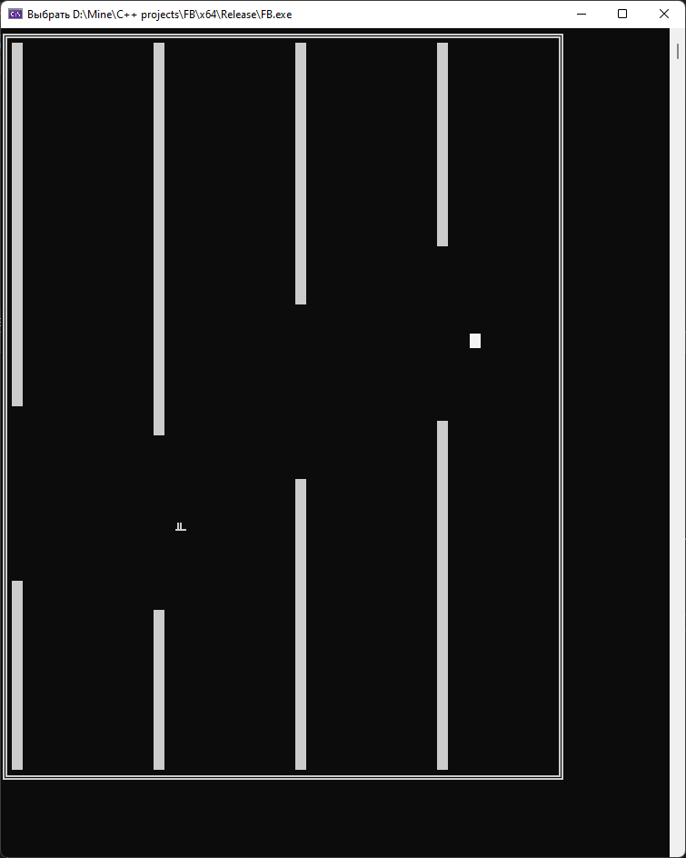
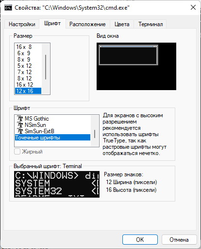

# Flappy bird

Проект реализует упрощённую версию игры Flappy bird в консоли.

## Правила

Не дайте птичке врезаться ни в одну из колонн. По нажатию на пробел она подпрыгнет в воздухе.

## Запуск

1) В настройках консоли установите следующий шрифт

2) Запускайте игру